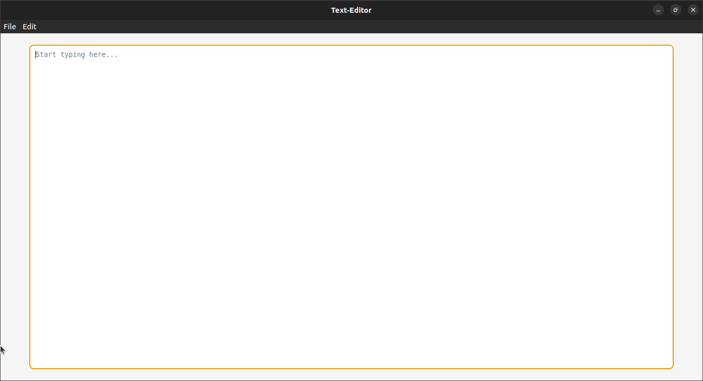

# **Text-Editor**

A lightweight and simple text editor built using [Electron.js](https://www.electronjs.org/). This application allows users to create, edit, and save text files with ease.

---

## **Features**
- Create new files.
- Open existing `.txt` files.
- Save files with or without a specified name (`Save` and `Save As` functionality).
- Supports **Cut**, **Copy**, and **Paste** operations.
- Simple and intuitive user interface.

---

## **Preview**  


---

## **Installation**

1. Clone the repository:
   ```bash
   https://github.com/yashraj-kumawat-14/Text-Editor.git
   cd text-editor

2. Install Dependencies:
   ```bash
   npm install

3. Run the application:
   ```bash
   npm start

## **Usage**

1.  Launch the app using the instructions above.
2.  Use the menu to:
   -  Create new files (File > New).
   -  Open existing text files (File > Open).
   -  Save or Save As files (File > Save / File > Save As).
3.  Use standard editing options (Edit > Cut / Copy / Paste).

## **Technologies Used**
-  Electron.js: To create the desktop app.
-  Node.js: For file system operations.
-  HTML/CSS/JavaScript: For the frontend.

## **Folder Structure**
```bash
electron-text-editor/
├── src/
│   ├── index.html      # Main HTML file
│   ├── renderer.js     # Renderer process logic
├── main.js             # Main process logic
├── package.json        # Project configuration
└── README.md           # Project documentation
